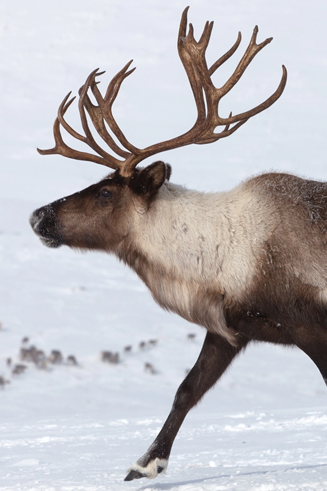
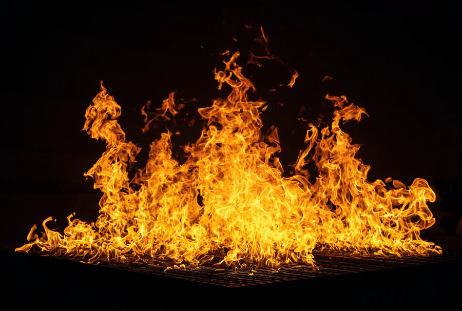

# An-Actual-Website-GitHub-Pages-
This is my website that I made for this assignment called "An Actual Website" It is for the class called AP Computer Science Principles. This Article is about the Artic Tundra.
# Species who live in the Tundra
Some species who live in Artic Tundra are the Artic wolf, the snowy hare, the snowy owl, lemmings, caribou, the Artic Fox, and many more animals. All of these species are accustomed to living in the bitter cold and have adapted this way. A lot of them also are white in color which is interesting as they can blend in with the snow. The type of species active can also vary by season as plants will sprout in the summer and be buried in the snow during winter. The tundra however is becoming more warmer over time due to climate change which is making more species migrate over there and bugs and plants more common as it is warm enough for them to be there even longer in the year now.

credits: National Geographic Kids
# Climate
The climate is very cold generally, as the permafrost(frozen ground) stays frozen all year usually(that is changing right now however). It isn't the coldest place though as it is colder further north and Antartica is **much** cooler than the Artic. In the summer, the temperature warms up a lot, but still generally stays cooler.
# Issues
Due to climate change, the Artic is warming up a lot and the permafrost is melting and realeasing pathogens that have been trapped in the ice for many years, which is a concern. It also changes the types of species that are active, allowing insects and plants to be active there longer throughout the year. There are also fires in Siberia now, which was never really a problem in the Artic before as it was too cool for fire to be able to be there, but as the Tundra warms, stuff is starting to burn, which is a huge concern as the forests of the tundra are vital for carbon management.

credits: google
# Things we can Do
We can stop using fossil fuels and transition to cleaner electric methods. We have to do this while still conserving space and making sure that organisms still have their space and are protected

**Thank you for reading this!!**
